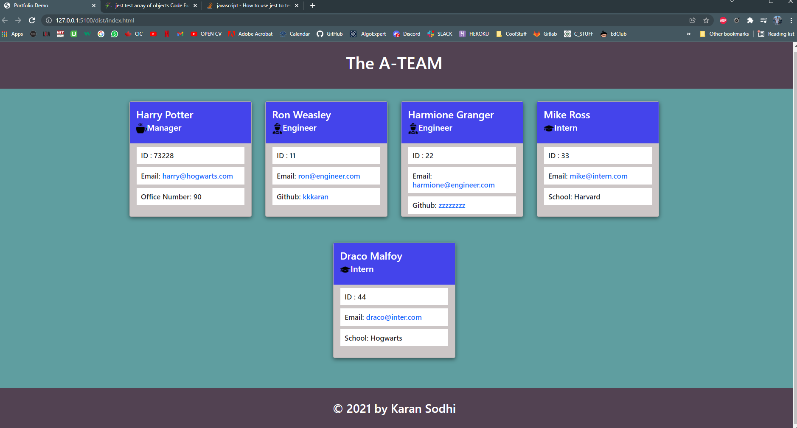

# Video Link: https://drive.google.com/drive/folders/1tTFLu-ICLvDWMK8Bul5zr5DYh8CUQOBv
<h1 align='center'>Team Profile Generator</h1>
    
    <h2 id="description">Description</h2>
    
In this app, we get user's input for the team members using inquirer and then write the index.html file that will be displayed in the browser.

    

    <h2>Table of Contents</h2>
    <ul>
        <li><a href="#description">Description</a></li>
        <li><a href="#install">Installation</a></li>
        <li><a href="#usage">Usage</a></li>
        <li><a href="#license">License</a></li>
        <li><a href="#contri">Contributing</a></li>
        <li><a href="#test">Tests</a></li>
        <li><a href="#question">Questions</a></li>
    </ul>
    

    <h2 id="install">Installation</h2>
    
Inquirer and  Jest

    

    <h2 id="usage">Usage</h2>
    
The user will run the index.js and provide all the inputs accordingly.

    

    <h2 id="license">License</h2>
    
    
MIT

    

    <h2 id="contri">Contributing</h2>
    
Karan Sodhi

    

    <h2 id="test">Tests</h2>
    
Unit Testing using jest

    

    <h2 id="question">Questions</h2>
    
Incase of questions, Find me on: 

    
 :<a href='mailto: karanpreetsodhi1997@gmail.com'>Email</a>

    
 :<a href='https://github.com/kkkaran'>Github</a>

